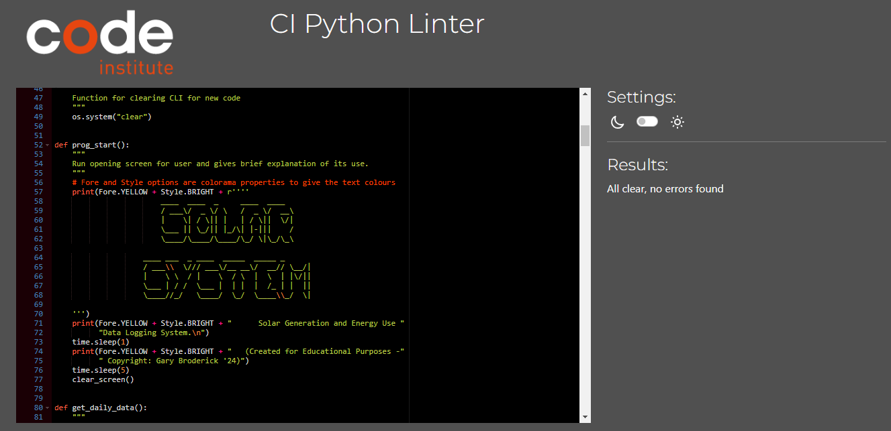

# Solar System App

## The Solar System app is a personalized application for my domestic solar panel installation. Designed to log my housholds daily, monthly, yearly energy usage and view electrical utility bill savings based on my current rate. Programmed in the app is the display functionality where I can view what my daily, monthly energy use is, how much money I am saving per month. There is also a display to monitor how much you are paying back on the installed system.

### PP3 - Gary Broderick

------------------------------------------------------------------------------------
## [ **Live Site** ](https://solar-system-f54a8eac54d6.herokuapp.com/)
## [ **Repository** ](https://github.com/gbroder24/solar-system.git)

## User Stories

### Project Goals

+ Provide a CLI app that is clear, concise and the process flows effortlessly.
+ Provide a CLI app that logs daily energy usage and solar generation.
+ Provide a CLI app that has a robust input validation quality software system.
+ Provide a CLI app that displays data to the user in a meaningful way.  

### User Goals

+ I want to understand the main objective of the program clearly to know its purpose.  
+ I want to easily understand how to input my data.
+ I want to recieve clear feedback when I input correct / incorrect data. 
+ I want to view my data and have it displayed in a clear and easy to understand format.

### Color Palette

The following colors were chosen for the app and ensure contrast is achieved in the main parts of the CLI. Colorama has been imported in to the run.py file to apply color to the terminal text. It makes the algorithm more intuitive and easy to understand.

+ Yellow is used for indicating the solar system app program starting screen and welcoming message.
+ Blue is used for indicating headings and user prompts in the terminal.
+ Green is used for indicating success or valid input from the user and displaying a positive balance.
+ Red is used for indicating no data available, errors or invalid input from the user and displaying a negative balance.

## Data Model

### Google Sheets Integration

The Solar System application interacts with Google Sheets to store daily and monthly energy usage that is consumed and imported from the grid. Solar generation data is also stored with monthly savings and project payback data. Data is stored in a tabular format.

### Worksheet Structure

The Google Sheets document contains three worksheets. One for storing daily energy usage and generation. The second to total monthly energy usage, generation and savings. The third to total the payback on the solar panel installed system. Each worksheet has columns for different data such as date, consumed, exported, imported, month year, savings and payback. It also includes calculated functionality in the monthly and payback worksheets.

### Daily Energy Use Data

Each daily energy use data entry includes the date, consumed (in kilowatts), Export (in kilowatts), Import (in kilowatts).

### Monthly Data

Monthly data is calculated based on the daily energy usage accumulated data. Consumed data, which is generated, is subtracted by imported data from the grid, the value from this then has the rate you buy applied. The exported data to the grid has the rate you sell applied. The summed calculation is stored in the savings column for each month of the year.

### Payback Data

Payback data is calculated based on the monthly savings accumulated data. Monthly savings is subtracted by project data, which is input from the user. The resulting calculation is stored in the payback worksheet cell and displayed to the terminal for user feedback. The value indicates if the user is making a deficit or a profit on the system.

### Data Validation

The application includes functions to validate input data to ensure it conforms to expected formats. Functions included are validating daily data and project data.

### User Interaction

A user interacts with the application through a terminal command line interface. User provides input for daily and project data, viewing daily and monthly data. A user can track their monthly savings month by month, year by year and payback on their investment.

### Data Processing

Data functions are programmed for calculating data, formatting data for display in tabular form, updating the Google Sheets document with new daily entries, monthly and payback updates.

## Flowchart

The following process flowchart was designed using Lucidchart in order to plan the process logic to be implemented in the algorithm.

## List of Features

### Welcoming Message

The user is greeted with a welcoming message to the Solar System app and a brief high level overview description.

### Main Menu

The user is presented with an ordered list, is prompted to choose from a list of five options and to input their choice.

### Enter Daily Energy Data

The user can enter daily energy data including the date, consumed (in kilowatts), Export (in kilowatts), Import (in kilowatts).

### View Daily Energy Data

The user can view their daily energy data directly from the terminal. Data is displayed in a table format, programmed using the import prettytable. Table headings included are the date, consumed (in kilowatts), Export (in kilowatts), Import (in kilowatts).

### View Monthly Energy Data and Savings

The user can view their monthly energy data and savings directly from the terminal. Data is displayed in a table format, programmed using the import prettytable. Table headings included are the date, consumed (in kilowatts), Export (in kilowatts), Import (in kilowatts) and savings (in euros).

### Enter Project Cost

The user is prompted to input the cost of their installed solar panel system.

### View Updated Project Cost

The user can view their updated project cost data directly from the terminal. Data is displayed in a table format, programmed using the import prettytable. Table heading included is the payback (in euros).

### Navigate Application

The user is presented with an ordered list, is prompted to choose from a list of two options and to input their choice. The user can navigate to the main menu or exit the program after viewing data tables.

### Exit Application

The user gets a confirmation message that is displayed in the terminal when exiting the program.

## Future Features

### Edit or Delete Daily Entries 

Allow the user to edit or delete daily entries. Provides the user with more functionality after entering their data incase the wrong data was entered.

### Input Energy Rate

Allow the user to input their current energy rate when the rate changes. Rates are currently volatile and providing this functionality offers more accuracy in calculating savings and project cost.

## Tools and Technologies

+ [ Python3 ](https://www.python.org/download/releases/3.0/).  
+ [ MarkDown ](https://github.com/luong-komorebi/Markdown-Tutorial/blob/master/README.md) Readme.md file.  
+ [ Github ](https://github.com/about) Repository.  
+ [ Gitpod ](https://www.gitpod.io/about) IDE.  
+ [ Git ](https://git-scm.com/about) Version control.  
+ [ W3schools ](https://www.w3schools.com/) Python tips.  
+ [ CI Python Linter ](https://pep8ci.herokuapp.com/#) to validate code to PEP8 standard.  
+ [ Heroku ](https://id.heroku.com/) to deploy the application.  
+ [ PrettyTable ](https://pypi.org/project/prettytable/) library was used to display the data in table format.  
+ [ Colorama ](https://pypi.org/project/colorama/) library was used to apply color to the terminal text.  
+ [ Gspread ](https://pypi.org/project/gspread/) library was used to interface for working with Google Sheets.  
+ [ Time ](https://pypi.org/project/time/) library was used for the conversion of given time input into proper format.  
+ [ Date Time ](https://docs.python.org/3/library/datetime.html#strftime-and-strptime-behavior) library was used for the conversion of given date and time input into proper format.  
+ [ Os ](https://docs.python.org/3/library/os.html) library was used to interact with the operating system to clear the terminal screen.  
+ [ Credentials ](https://pypi.org/project/credentials/) library was used to install credentials.  
+ [ Default Dictionary ](https://docs.python.org/3/library/collections.html) library was used to create dictionary. 
+ [Lucidchart](https://www.lucidchart.com/pages/) was used to create the process flowchart.  

## Testing
Test scenarios for the Solar System application were created by the Full Stack Software Developer (Gary Broderick). The application was manually tested, validated and results recorded. User testing (by family and friends) was also executed.

### Testing User Stories

+ As a user, I want to understand the main objective of the program clearly to know its purpose.

   - Details about the the Solar Stystem application are displayed in the welcome message with a brief overview of the application.

+ As a user, I want to easily understand how to input my data.

   - Input prompts are displayed in blue text, clearly indicating the required input from the user.
   
   - Detailed information is provided alongside the input prompts, explaining the format and type of data expected from the user.

+ As a user, I want to recieve clear feedback when I input correct / incorrect data.

   - Error messages are prominently displayed in red, clearly indicating when incorrect input format is provided.

   - Error messages explain the issue with the input provided, helping the user understand what went wrong and how to correct it.

+ As a user, I want to view my data and have it displayed in a clear and easy to understand format.

   - Daily, monthly and project data are displayed in a clear and visually appealing manner, utilizing a table format to enhance clarity.

### Application
The following test scenarios were executed on the application and results recorded:

<table>
    <tr>
        <th>Feature</th>
        <th>Scenario</th>
        <th>Expected Result</th>
        <th>Result</th>
    </tr>
    <tr>
        <td rowspan=2>Main Menu</td>
        <td>Validates that input for the main menu choice is one of the valid options: 1, 2, 3, 4 or 5.</td>
        <td></td>
        <td>Pass</td>
    </tr>
        <td>Validates that input for the submenu choice is one of the valid options: 1 or 2</td>
        <td></td>
        <td>Pass</td>
    </tr>   
    <tr>
        <td rowspan=2>Daily Data Entry Values</td>
        <td>Validates that exactly 4 values have been entered correctly: Day Month Year, Consumed (kW), Export (kW), Import (kW).</td>
        <td></td>
        <td>Pass</td>
    </tr>
        <td>Validates that exactly 4 values have been not been entered correclty.</td>
        <td></td>
        <td>Pass</td>
    </tr>
    <tr>
        <td rowspan=3>Daily Date Format</td>
        <td>Validates the daily date format (Day Month Year).</td>
        <td></td>
        <td>Pass</td>
    </tr>
        <td>Validate the duplicate daily date format (Day Month Year)</td>
        <td></td>
        <td>Pass</td>
    </tr>   
        <td>Validate todays daily date format (Day Month Year)</td>
        <td></td>
        <td>Pass</td>
    </tr>   
    <tr>
        <td>Validate Daily Energy Integer Validation</td>
        <td>Validates that the value entered is an interger number.</td>
        <td></td>
        <td>Pass</td>
    </tr>
    <tr>
        <td rowspan=3>Project Data Entry Values</td>
        <td>Validates value has been entered correctly: Payback (€).</td>
        <td></td>
        <td>Pass</td>
    </tr>
        <td>Validates that the value entered is an interger number.</td>
        <td></td>
        <td>Pass</td>
    </tr>
    <td>Validates that exactly 1 value has not been entered correclty.</td>
        <td></td>
        <td>Pass</td>
    </tr>
    <tr>
        <td rowspan=3>Project Data Display Values</td>
        <td>Validates positive balance value has been displayed correctly: Payback (€).</td>
        <td></td>
        <td>Pass</td>
    </tr>
        <td>Validates negative balance value has been displayed correctly: Payback (€).</td>
        <td></td>
        <td>Pass</td>
    </tr>
    <td>Validates even balance value has been displayed correctly: Payback (€).</td>
        <td></td>
        <td>Pass</td>
    </tr>
</table>

## Python3 PEP8 Validation
All python code was validated using the Code Institute Python Linter. No errors found.

## Deployment

The application has been deployed on Heroku by using the following steps:

1. Create the list of requirements. Run `pip3 freeze > requirements.txt` in the terminal.
2. Add, commit and push the changes to GitHub.
3. Go to the Heroku's website and sign-up for a free student account.
4. From the Heroku dashboard, click on "Create new app" button.
5. Enter the "App name" and "Choose a region" before clicking on "Create app".
6. Go to "Config Vars" under the "Settings" tab.
7. Click on "Reveals Config Vars" and add the KEY: CREDS and the values stored in creds.json file if needed.
8. Add the Config Var, KEY: PORT and VALUE: 8000.
9. Go to "Buildpacks" section and click "Add buildpack".
10. Select "python" and click "Save changes"
11. Add "nodejs" buildpack as well using the same process.
12. Go to "Deployment method", under the "Deploy" tab select "GitHub" and click on "Connect to GitHub".
13. Go to "Connect to GitHub" section and "Search" the repository to be deployed.
14. Click "Connect" next the repository name.
15. Choose "Automatic deploys" or "Manual deploys" to deploy your application.

## Credits

+ [ Stack Overflow ](https://stackoverflow.com/questions/75731307/inserting-a-python-list-in-a-column-in-google-sheet-using-gspread-and-sheet-api) for gspread cell tips.  
+ [ Influx Data ](https://www.influxdata.com/blog/python-date-comparison-comprehensive-tutorial/#:~:text=Compare%20two%20dates%20without%20time,-You%20can%20use&text=date()%20date2%20%3D%20datetime2.,Date2%20are%20the%20same.%22) for understanding date comparisons.  
+ [ Python Docs ](https://docs.python.org/3/library/datetime.html#strftime-and-strptime-behavior) to gain an understanding of the strptime method.  
+ [ Stack Overflow ](https://stackoverflow.com/questions/70263910/colorama-wont-stop-printing-colored-text) for colorma tips.  
+ [ Snyk.io ](https://snyk.io/advisor/python/colorama/functions/colorama.Fore.RESET) for tips on how to reset colorama.  
+ [ 101computing ](https://www.101computing.net/python-typing-text-effect/) for time delays and clearing screen.

+ [ Markdown Monster ](https://markdownmonster.west-wind.com/docs/_53a0pfz0t.htm#:~:text=%3E-,Markdown%20Support%20for%20Tables,is%20rendering%20the%20Markdown%20text.) for creating tables in readme.md in html code.

+ [ Code Institute Template ](https://github.com/Code-Institute-Org/p3-template) for Python language.

+ [ Code Institute ](https://github.com/Code-Institute-Solutions/love-sandwiches-p5-sourcecode/tree/master/02-accessing-user-data/01-requesting-data-from-the-user) for the Love Sandwiches walkthrough project.

### Readme
The Solar System readme mark down was inspired by the following:

[ Bake Stock ](https://github.com/amylour/BakeStock/blob/main/run.py)

[ Fitness Tracker ](https://github.com/Alvor1991/PP3-Python/blob/main/README.md)

[ Irish Animal Habitat ](https://github.com/gbroder24/irish-animal-habitat/blob/main/README.md)

### Acknowledgements

My Mentor Alan Bushell for providing me with positive and encouraging feedback.  
My Cohort Facilitator Amy Richardson for addressing any queries I had at weekly Standups.
